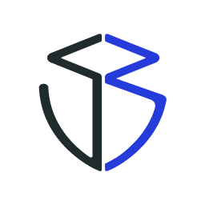

Updated in 02-May-24

# Hi I'm Huy, an independent security researcher
- Contact me: 
    + Mail: 0xhuy0512@gmail.com
    + Twitter/X: [0xhuy0512](https://twitter.com/0xhuy0512)
# Experience
- Education: Bachelors of Information Technology at [UET-VNU (University of Engineering and Technology - Vietnam National University)](https://uet.vnu.edu.vn/en/)
- June 2022 - June 2023: Solidity developer at [Sotatek](https://www.sotatek.com/about-us/)
- June 2023 - Now: Independent smart contract security researcher

# Highlights
- Audited 20 contests
- Found 22 High bugs and 28 Medium bugs in contest
- Found 1 Critical and 1 High bugs in live bug bounties
- Placed 1st in [Mitosis contest](https://secure3.io/contest/e377f59b8e) on Secure3
- Placed 4th in [Wormhole contest](https://cantina.xyz/code/627528d0-db8a-4c42-b8b4-a5760ff31baf/README.md) on Cantina
- Placed 5th in [IronBank contest](https://audits.sherlock.xyz/contests/84/leaderboard) on Sherlock
- Placed 6th in [3DNS contest](https://cantina.xyz/code/cdb738fd-0e7f-4a6b-9073-2b8629bfc1c3/README.md) on Cantina

# Audit Contest
| Contest | Found | Report   | nSLOC | Date | Platform | Category
|:--:|:--:|:--:|:--:|:--:|:--:|:--:|
| [EthosX Operp](https://secure3.io/contest/e377f59b8e)     | ... | ... | 879 |Apr 2024 | Secure3  | Put options
| [Wormhole](https://cantina.xyz/code/627528d0-db8a-4c42-b8b4-a5760ff31baf/README.md)     | 1 M | [link](https://github.com/tnquanghuy0512/audits/blob/main/Cantina/2024-03-wormhole.md) | 2495 |Mar 2024 | Cantina  | Crosschain, bridge
| [Mitosis](https://secure3.io/contest/e377f59b8e)     | 7 H, 2 M, 2 L | [link](https://github.com/tnquanghuy0512/audits/blob/main/Private%20audit/Secure3/2024-02-mitosis.md) | 1163 |Feb 2024 | Secure3  | Crosschain liquidity
| [3DNS](https://cantina.xyz/code/cdb738fd-0e7f-4a6b-9073-2b8629bfc1c3/README.md)     | 2 H, 2 M | [link](https://github.com/tnquanghuy0512/audits/blob/main/Cantina/2024-02-3dns.md) | 2301 |Feb 2024 | Cantina  | Domain marketplace, ENS
|[Arcadia](https://audits.sherlock.xyz/contests/137)          | 1 M | [link](https://github.com/tnquanghuy0512/audits/blob/main/Sherlock/2024-02-arcadia.md) | 3054 | Feb 2024 | Sherlock  | Lending
|[LookRare YOLO](https://audits.sherlock.xyz/contests/163)          | 1 H | [link](https://github.com/tnquanghuy0512/audits/blob/main/Sherlock/2024-01-lookrare-yolo.md) | 1090 | Jan 2024 | Sherlock  | Onchain Game
| [Superform](https://cantina.xyz/competitions/2cd0b038-3e32-4db6-b488-0f85b6f0e49f)     | 1 M | [link](https://github.com/tnquanghuy0512/audits/blob/main/Cantina/2023-12-superform.md) | 6858 |Dec 2023 | Cantina  | Crosschain liquidity, LayerZero
| [Magpie Launchpad Update](https://secure3.io/contest/89039b8f)     | 1 M, 4 L | [link](https://github.com/tnquanghuy0512/audits/blob/main/Private%20audit/Secure3/2023-12-magpie-launchpad-update.md) | 443 |Dec 2023 | Secure3  | Launchpad
| [Magpie Launchpad](https://secure3.io/contest/766a8309)     | 7 L | [link](https://github.com/tnquanghuy0512/audits/blob/main/Private%20audit/Secure3/2023-11-magpie-launchpad.md) | 442 |Nov 2023 | Secure3  | Launchpad
| [Canto](https://code4rena.com/audits/2023-11-canto-application-specific-dollars-and-bonding-curves-for-1155s#top)                     | 2 M | [link](https://github.com/tnquanghuy0512/audits/blob/main/Code4rena/2023-12-canto.md) | 316  | Nov 2023 | Code4rena  | Stablecoin, ERC1155
| [Next Gen](https://code4rena.com/audits/2023-10-nextgen#top)                      | 1 H, 2 M | [link](https://github.com/tnquanghuy0512/audits/blob/main/Code4rena/2023-11-nextgen.md) | 1256 | Nov 2023 | Code4rena  | NFT, Generative art
| [Ethena Labs](https://code4rena.com/audits/2023-10-ethena-labs#top)               | 1 M | [link](https://github.com/tnquanghuy0512/audits/blob/main/Code4rena/2023-10-open-dollar.md) | 588  | Sep 2023 | Code4rena  | Perpetuals position, Stablecoin
| [Open Dollar](https://code4rena.com/audits/2023-10-open-dollar#top)               | 1 H, 6 M | [link](https://github.com/tnquanghuy0512/audits/blob/main/Code4rena/2023-10-ethena-labs.md) | 998  | Sep 2023 | Code4rena  | Lending, Stablecoin
| [Dopex](https://code4rena.com/audits/2023-08-dopex#top)                           | 1 H, 1 M | [link](https://github.com/tnquanghuy0512/audits/blob/main/Code4rena/2023-09-dopex.md) | 2264 | Sep 2023 | Code4rena  | Staking
|[Allo V2](https://audits.sherlock.xyz/contests/109)          | 1 H, 5 M | [link](https://github.com/tnquanghuy0512/audits/blob/main/Sherlock/2023-09-allo-v2.md) | 1648 | Sep 2023 | Sherlock  | Services
| [Tangible Caviar](https://code4rena.com/contests/2023-08-tangible-caviar#top)     | 4 H | [link](https://github.com/tnquanghuy0512/audits/blob/main/Code4rena/2023-08-tangible-caviar.md) | 1503 | Aug 2023 | Code4rena  | Vote escrow
| [Beedle](https://www.codehawks.com/contests/clkbo1fa20009jr08nyyf9wbx)         | 2 H, 1 M | [link](https://github.com/tnquanghuy0512/audits/blob/main/CodeHawks/2023-07-beedle.md) | 706 |Jul 2023 | CodeHawks  | Lending
| [Stablecoin](https://www.codehawks.com/contests/cljx3b9390009liqwuedkn0m0)     | 1 H, 1 M | [link](https://github.com/tnquanghuy0512/audits/blob/main/CodeHawks/2023-07-stablecoin.md) | 236 |Jul 2023 | CodeHawks  | Stablecoin
| [Bond Options](https://audits.sherlock.xyz/contests/99)     | 1 H | [link](https://github.com/tnquanghuy0512/audits/blob/main/Sherlock/2023-05-bond-options.md) | 874  | Jul 2023 | Sherlock  | Services
| [Iron Bank](https://audits.sherlock.xyz/contests/84)        | 1 M | [link](https://github.com/tnquanghuy0512/audits/blob/main/Sherlock/2023-05-ironbank.md) | 2250 |Jun 2023 | Sherlock  | Lending

### Bug bounties
| Project | Severity | Report | Status | Date| Platform| Category
|:--:|:--:|:--:|:--:|:--:|:--:|:--:|
| Pika Protocol V4 | 1 Critical | [link](https://github.com/tnquanghuy0512/audits/blob/main/Immunefi/2024-01-pika-protocol.md) | Valid but duplicated | Jan 2024 | Immunefi | Futures trading
| LandX | 1 High | [link](https://github.com/tnquanghuy0512/audits/blob/main/Immunefi/2023-12-land-x.md) | Valid but not fixed | Sep 2023 | Immunefi  | Real world assets

