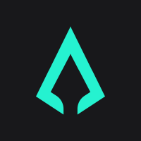

Updated: Mar 6, 2025

# Hi, I'm Huy, an independent Web3 security researcher

## About Me
Highly skilled smart contract security researcher with a focus on EVM-compatible and Solana blockchain ecosystems. With proven ability to detect and report critical vulnerabilities across a range of blockchain platforms, I provide expert smart contract security services.

I have been trusted by and secured smart contracts for major DeFi protocols such as [Infinex](https://infinex.xyz/), [Connext](https://www.connext.network/), [Maple](https://maple.finance/), [Thirdweb](https://thirdweb.com/), and other multi-million-dollar protocols.

## Technical Expertise
- **Languages**: Solidity, Rust
- **Platforms**: EVM, Solana
- **Focus Areas**: Smart contract security

## Contact me
- **Mail**: [`0xhuy0512@gmail.com`](mailto:0xhuy0512@gmail.com)
- **Twitter/X**: [`@0xhuy0512`](https://twitter.com/0xhuy0512)
- **Telegram**: [`@Oxhuy0512`](https://t.me/Oxhuy0512)
- **Discord**: [`0xhuy0512`](https://discordapp.com/users/1082973034148798555)

# Experience
<!-- - Education: Bachelor of Information Technology at [UET-VNU (University of Engineering and Technology - Vietnam National University)](https://uet.vnu.edu.vn/en/) -->
- **June 2022 - June 2023**: Fullstack EVM and Algorand developer at [Sotatek](https://www.sotatek.com/about-us/)
- **June 2023 - Present**: Independent Web3 security researcher. Participating in contests, collaborating with [0xMacro](https://0xmacro.com/), [Spearbit](https://spearbit.com/), [Hashlock](https://hashlock.com/). Hunting bug bounties on Immunefi
<!-- - **June 2024 - Present**: Working with [0xMacro](https://0xmacro.com/) as a Staff auditor -->

# Highlights

- Participated in over 30 private audits with [0xMacro](https://0xmacro.com/), [Spearbit](https://spearbit.com/), and [Hashlock](https://hashlock.com/)
- Participated in over 25 public contest audits, identifying 25+ High and 30+ Medium severity bugs
- Discovered 1 Critical and 1 High bug in live bug bounties
- 🥇 place in three contests on Secure3
- 🥈 place in [Ethos Reputation contest](https://audits.sherlock.xyz/contests/735) on Sherlock
- 4th place in [Wormhole contest](https://cantina.xyz/code/627528d0-db8a-4c42-b8b4-a5760ff31baf/README.md) on Cantina
- 5th place in [IronBank contest](https://audits.sherlock.xyz/contests/84/leaderboard) on Sherlock
<!-- - Placed 6th in [3DNS contest](https://cantina.xyz/code/cdb738fd-0e7f-4a6b-9073-2b8629bfc1c3/README.md) on Cantina -->
<!-- - 🥇 place  in [Mitosis contest](https://secure3.io/contest/e377f59b8e) on Secure3
- 🥇 place in [FBTC contest](https://app.secure3.io/614576bf93) on Secure3 -->

# Private audit works
### Non-Solidity works
| Audit | Found | Report  | Date | Platform | Category
|:--:|:--:|:--:|:--:|:--:|:--:|
Perena | ... | ... | Mar 2025 | Spearbit  | Solana , Native Rust, Stablecoin |
ORO | 9 Critical, 2 High, 5 Medium | ... | Mar 2025 | Spearbit  | Solana , Anchor, RWAs |
[SevenSeas-29](https://sevenseas.capital/) | 1 High, 3 Medium, 2 Low, 14 Quality | [link](https://0xmacro.com/library/audits/sevenSeas-29)  | Feb 2025 | 0xMacro  | Solana , Anchor, Yielding |
[SevenSeas-20](https://sevenseas.capital/) | 1 Low, 4 Quality | [link](https://0xmacro.com/library/audits/sevenSeas-20)  | Nov 2024 | 0xMacro  | Solana , Anchor, Hyperlane integration |
[Kwenta-18](https://v2.kwenta.io/) | 1 Critical, 2 High, 2 Medium, 2 Low, 6 Quality | [link](https://0xmacro.com/library/audits/kwenta-18) | Aug 2024 | 0xMacro  | Golang , zero-knowledge |

### Solidity works 
| Audit | Found | Report  | Date | Platform | Category
|:--:|:--:|:--:|:--:|:--:|:--:|
[Digital Era Bank](https://www.digitalerabank.com/) | 1 Medium, 1 Low | Private | Jan 2025 | Hashlock  | Stablecoin |
[Superstate-5](https://superstate.co/) | 3 Quality | [link](https://0xmacro.com/library/audits/superstate-5) | Jan 2025 | 0xMacro  | Treasury Bills |
[Agora-1](https://www.agora.finance/) | 1 Critical, 2 Medium, 2 Low, 11 Quality | Private | Dec 2024 | 0xMacro  | Stablecoin AMM |
[Infinex-15](https://infinex.xyz/) | 1 Low, 1 Quality, 1 Informational | [link](https://0xmacro.com/library/audits/infinex-15) | Dec 2024 | 0xMacro  | Smart Contract Wallet |
[Infinex-14](https://infinex.xyz/) | 1 Medium, 3 Low, 6 Quality, 1 Informational | [link](https://0xmacro.com/library/audits/infinex-14) | Nov 2024 | 0xMacro  | Smart Contract Wallet |
[Superstate-3](https://superstate.co/) | 3 Medium, 2 Low, 5 Quality | [link](https://0xmacro.com/library/audits/superstate-3) | Nov 2024 | 0xMacro  | Oracle, Treasury Bills |
[QTOK](https://qtok.io/) | 2 High, 6 Medium, 16 Low, 2 Gas Opt | Private | Oct 2024 | Hashlock  | Presale, Staking, Vesting |
[Infinex-12](https://infinex.xyz/) | 4 Low, 2 Quality, 1 Gas Opt | [link](https://0xmacro.com/library/audits/infinex-12) | Oct 2024 | 0xMacro  | Smart Contract Wallet |
[Infinex-11](https://infinex.xyz/) | 2 Medium, 5 Low, 9 Quality, 1 Gas Opt | [link](https://0xmacro.com/library/audits/infinex-11) | Oct 2024 | 0xMacro  | Smart Contract Wallet |
[Dorge-3](https://dorge.com/) | 1 Low, 1 Quality, 1 Gas Opt | Private | Oct 2024 | 0xMacro  | Presale |
[LottoPGF](https://lottopgf.org/) | 4 High, 2 Medium, 14 Low | Private | Sep 2024 | Hashlock  | Lottery |
[Infinex-9](https://infinex.xyz/) | 1 Critical, 1 Medium | [link](https://0xmacro.com/library/audits/infinex-9) | Sep 2024 | 0xMacro  | Smart Contract Wallet |
[Prodds](https://prodds.xyz/) | 1 High, 1 Medium, 13 Low, 2 Gas Opt | Private | Sep 2024 | Hashlock  | Betting |
[Infinex-8](https://infinex.xyz/) | 1 Quality, 1 Gas Opt | [link](https://0xmacro.com/library/audits/infinex-8) | Aug 2024 | 0xMacro  | Smart Contract Wallet |
[Infinex-7](https://infinex.xyz/) | 2 High, 1 Quality, 4 Gas Opt | Private | Aug 2024 | 0xMacro  | Smart Contract Wallet |
[Maple-2](https://maple.finance/) | 1 Low, 2 Quality | [link](https://0xmacro.com/library/audits/maple-2)| Aug 2024 | 0xMacro  | Lending |
[Infinex-6](https://infinex.xyz/) | 2 Low, 6 Quality | [link](https://0xmacro.com/library/audits/infinex-6) | Jul 2024 | 0xMacro  | Smart Contract Wallet |
[Infinex-5](https://infinex.xyz/) | 3 Medium, 4 Low, 3 Quality | [link](https://0xmacro.com/library/audits/infinex-5) | Jul 2024 | 0xMacro  | Smart Contract Wallet |
[Kwenta-16](https://v2.kwenta.io/) | 2 Medium, 1 Low, 6 Quality, 1 Informational | [link](https://0xmacro.com/library/audits/kwenta-16) | Jul 2024 | 0xMacro  | ERC-4337 |
[Superstate-2](https://superstate.co/) | 1 Medium, 8 Quality | [link](https://0xmacro.com/library/audits/superstate-2) | Jul 2024 | 0xMacro  | Treasury Bills |
[Dorge-1](https://dorge.com/) | 2 Low, 6 Quality | Private | Jul 2024 | 0xMacro  | Presale |
[Connext-7](https://www.connext.network/) | 1 Critical, 2 Medium, 1 Low, 3 Quality, 2 Informational | [link](https://0xmacro.com/library/audits/connext-7) | Jun 2024 | 0xMacro  | Crosschain |
[Mintra-2](https://www.mintra.ai/) | 1 High, 3 Medium, 7 Low, 8 Quality, 1 Informational | [link](https://0xmacro.com/library/audits/mintra-2) | Jun 2024 | 0xMacro  | Launchpad |
[Thirdweb-19](https://thirdweb.com/) | 7 Medium, 10 Low, 6 Quality | [link](https://0xmacro.com/library/audits/thirdweb-19) | Jun 2024 | 0xMacro  | Public Library |

<!-- Infinex-15b | . | . | . | Nov 2024 | Smart contract wallet | -->
<!-- Infinex-13 | . | . | Oct 2024 | Smart contract wallet |

-->
<!-- Infinex-7b | . | . | . | Sep 2024 | Smart contract wallet | -->
<!-- Infinex-10 | No issue | [link](https://0xmacro.com/library/audits/infinex-10) | . | Sep 2024 | Smart contract wallet | -->
<!-- Infinex-7 | . | . | . | Aug 2024 | Smart contract wallet | -->

# Audit Contests
| Contest | Found | Report  | Date | Platform | Category
|:--:|:--:|:--:|:--:|:--:|:--:|
| [Ethos Reputation](https://audits.sherlock.xyz/contests/735)| 1 Medium | [link](https://github.com/tnquanghuy0512/audits/blob/main/Sherlock/2024-12-ethos.md)  | Dec 2024 | Sherlock  | Marketplace
| [Omni Network](https://cantina.xyz/competitions/d139882b-2d3a-49ac-9849-9dccef584090) | 1 Medium | [link](https://github.com/tnquanghuy0512/audits/blob/main/Cantina/2024-10-omni.md)  | Oct 2024 | Cantina  | L1 Infrastructure, Golang
| [FBTC](https://app.secure3.io/614576bf93)     | 2 High | [link](https://github.com/tnquanghuy0512/audits/blob/main/Private%20audit/Secure3/2024-05-fbtc.md) |May 2024 | Secure3  | BTC bridge
| [Optimism Safe Extensions](https://cantina.xyz/competitions/d47f8096-8858-437d-a9f5-2fe85ac9b95e)     | 1 Medium | [link](https://github.com/tnquanghuy0512/audits/blob/main/Cantina/2024-05-optimism-safe-extensions.md)  |May 2024 | Cantina  | Gnosis Safe, Security Council
| [EthosX Operp](https://app.secure3.io/d8d9615103)     | 1 Medium | [link](https://github.com/tnquanghuy0512/audits/blob/main/Private%20audit/Secure3/2024-04-ethosx-operp.md)  |Apr 2024 | Secure3  | Put options
| [Wormhole](https://cantina.xyz/code/627528d0-db8a-4c42-b8b4-a5760ff31baf/README.md)     | 1 Medium | [link](https://github.com/tnquanghuy0512/audits/blob/main/Cantina/2024-03-wormhole.md)  |Mar 2024 | Cantina  | Crosschain, bridge
| [Mitosis](https://secure3.io/contest/e377f59b8e)     | 7 High, 2 Medium, 2 Low | [link](https://github.com/tnquanghuy0512/audits/blob/main/Private%20audit/Secure3/2024-02-mitosis.md)  |Feb 2024 | Secure3  | Crosschain liquidity
| [3DNS](https://cantina.xyz/code/cdb738fd-0e7f-4a6b-9073-2b8629bfc1c3/README.md)     | 2 High, 2 Medium | [link](https://github.com/tnquanghuy0512/audits/blob/main/Cantina/2024-02-3dns.md) |Feb 2024 | Cantina  | Domain marketplace, ENS
| [Arcadia](https://audits.sherlock.xyz/contests/137)          | 1 Medium | [link](https://github.com/tnquanghuy0512/audits/blob/main/Sherlock/2024-02-arcadia.md) | Feb 2024 | Sherlock  | Lending
| [LookRare YOLO](https://audits.sherlock.xyz/contests/163)          | 1 High | [link](https://github.com/tnquanghuy0512/audits/blob/main/Sherlock/2024-01-lookrare-yolo.md)  | Jan 2024 | Sherlock  | Onchain Game
| [Superform](https://cantina.xyz/competitions/2cd0b038-3e32-4db6-b488-0f85b6f0e49f)     | 1 Medium | [link](https://github.com/tnquanghuy0512/audits/blob/main/Cantina/2023-12-superform.md)  |Dec 2023 | Cantina  | Crosschain liquidity, LayerZero
| [Magpie Launchpad Update](https://secure3.io/contest/89039b8f)     | 1 Medium, 4 Low | [link](https://github.com/tnquanghuy0512/audits/blob/main/Private%20audit/Secure3/2023-12-magpie-launchpad-update.md) |Dec 2023 | Secure3  | Launchpad
| [Magpie Launchpad](https://secure3.io/contest/766a8309)     | 7 Low | [link](https://github.com/tnquanghuy0512/audits/blob/main/Private%20audit/Secure3/2023-11-magpie-launchpad.md)  |Nov 2023 | Secure3  | Launchpad
| [Canto](https://code4rena.com/audits/2023-11-canto-application-specific-dollars-and-bonding-curves-for-1155s#top)                     | 2 Medium | [link](https://github.com/tnquanghuy0512/audits/blob/main/Code4rena/2023-12-canto.md)   | Nov 2023 | Code4rena  | Stablecoin, ERC1155
| [Next Gen](https://code4rena.com/audits/2023-10-nextgen#top)                      | 1 High, 2 Medium | [link](https://github.com/tnquanghuy0512/audits/blob/main/Code4rena/2023-11-nextgen.md)  | Nov 2023 | Code4rena  | NFT, Generative art
| [Ethena Labs](https://code4rena.com/audits/2023-10-ethena-labs#top)               | 1 Medium | [link](https://github.com/tnquanghuy0512/audits/blob/main/Code4rena/2023-10-ethena-labs.md)   | Sep 2023 | Code4rena  | Perpetual positions, Stablecoin
| [Open Dollar](https://code4rena.com/audits/2023-10-open-dollar#top)               | 1 High, 6 Medium | [link](https://github.com/tnquanghuy0512/audits/blob/main/Code4rena/2023-10-open-dollar.md)  | Sep 2023 | Code4rena  | Lending, Stablecoin
| [Dopex](https://code4rena.com/audits/2023-08-dopex#top)                           | 1 High, 1 Medium | [link](https://github.com/tnquanghuy0512/audits/blob/main/Code4rena/2023-09-dopex.md)  | Sep 2023 | Code4rena  | Staking
| [Allo V2](https://audits.sherlock.xyz/contests/109)          | 1 High, 5 Medium | [link](https://github.com/tnquanghuy0512/audits/blob/main/Sherlock/2023-09-allo-v2.md)  | Sep 2023 | Sherlock  | Services
| [Tangible Caviar](https://code4rena.com/contests/2023-08-tangible-caviar#top)     | 4 High | [link](https://github.com/tnquanghuy0512/audits/blob/main/Code4rena/2023-08-tangible-caviar.md)  | Aug 2023 | Code4rena  | Vote escrow
| [Beedle](https://www.codehawks.com/contests/clkbo1fa20009jr08nyyf9wbx)         | 2 High, 1 Medium | [link](https://github.com/tnquanghuy0512/audits/blob/main/CodeHawks/2023-07-beedle.md)  |Jul 2023 | CodeHawks  | Lending
| [Stablecoin](https://www.codehawks.com/contests/cljx3b9390009liqwuedkn0m0)     | 1 High, 1 Medium | [link](https://github.com/tnquanghuy0512/audits/blob/main/CodeHawks/2023-07-stablecoin.md)  |Jul 2023 | CodeHawks  | Stablecoin
| [Bond Options](https://audits.sherlock.xyz/contests/99)     | 1 High | [link](https://github.com/tnquanghuy0512/audits/blob/main/Sherlock/2023-05-bond-options.md)   | Jul 2023 | Sherlock  | Services
| [Iron Bank](https://audits.sherlock.xyz/contests/84)        | 1 Medium | [link](https://github.com/tnquanghuy0512/audits/blob/main/Sherlock/2023-05-ironbank.md)  |Jun 2023 | Sherlock  | Lending

### Bug bounties
| Project | Severity | Report | Status | Date| Platform| Category
|:--:|:--:|:--:|:--:|:--:|:--:|:--:|
| Pika Protocol V4 | 1 Critical | [link](https://github.com/tnquanghuy0512/audits/blob/main/Immunefi/2024-01-pika-protocol.md) | Valid but duplicated | Jan 2024 | Immunefi | Futures trading
| LandX | 1 High | [link](https://github.com/tnquanghuy0512/audits/blob/main/Immunefi/2023-12-land-x.md) | Valid but not fixed | Sep 2023 | Immunefi  | Real world assets

